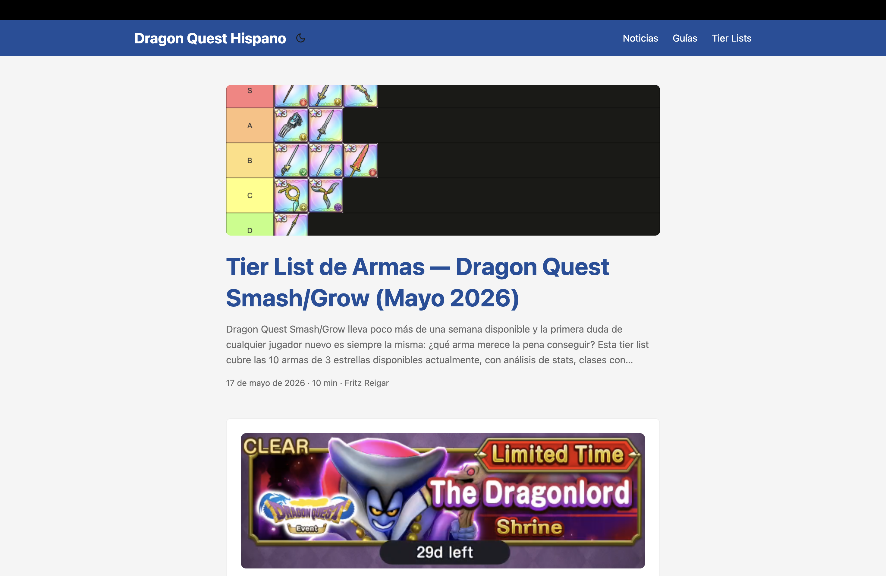
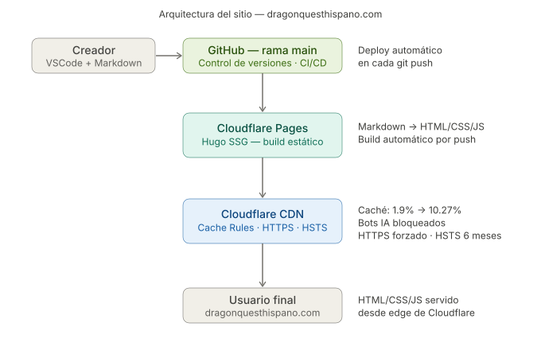
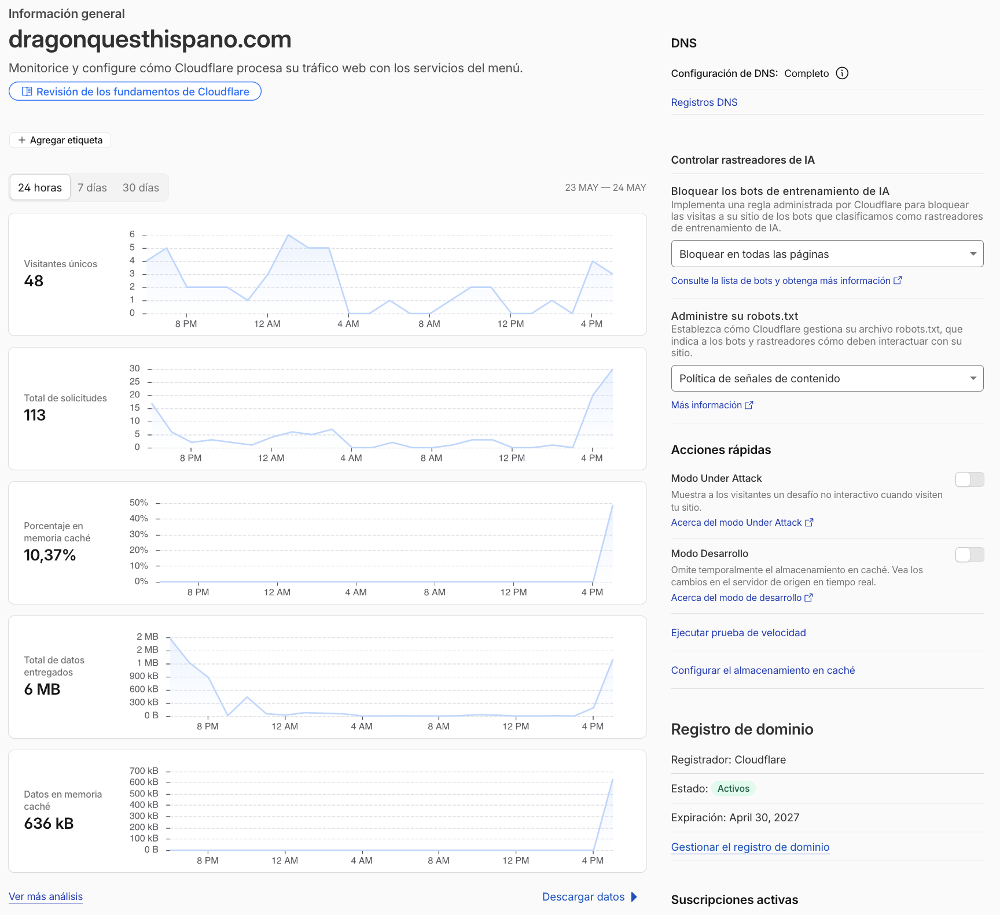
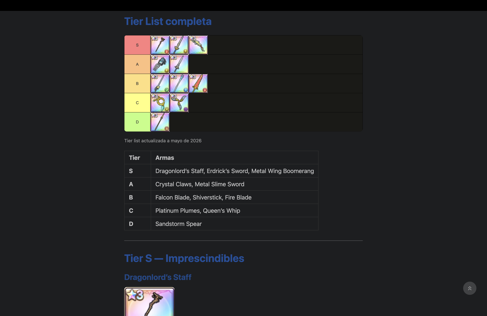

# Dragon Quest Hispano

Primera web en español dedicada a Dragon Quest Smash/Grow y la saga Dragon Quest completa.

🌐 [dragonquesthispano.com](https://dragonquesthispano.com)

---

## Por qué existe este proyecto

La idea surgió por la falta de contenido e información de Dragon Quest en la comunidad hispanohablante. Con la salida de Dragon Quest VII Reimagined, Dragon Quest Smash/Grow y los futuros anuncios del 40º aniversario de la saga, vi una oportunidad para crear una web dedicada a esta franquicia y aprender a maquetar webs de información reales con stack moderno.

---

## Stack técnico

- **Hugo** — generador de sitios estáticos
- **PaperMod** — tema base, personalizado con CSS propio
- **GitHub** — control de versiones, rama `main` como fuente de verdad
- **Cloudflare Pages** — CI/CD automático: cada push a `main` despliega
- **Cloudflare CDN** — caché en edge, HTTPS forzado, HSTS, bloqueo de bots IA
- **Markdown** — formato de todo el contenido editorial

---

## Arquitectura

---

## Funcionalidades implementadas

- Secciones independientes: Noticias, Guías, Tier Lists
- Sistema de tags estructurado (`smash-grow`, `smash-grow-guia`, `smash-grow-tier-list`...)
- Modo claro/oscuro
- CSS semántico custom (`.img-weapon`, `.img-banner`, `.img-map`, `.img-build-screenshot`...)
- SEO automático vía Hugo
- Dominio secundario `dragonquestes.com` redirigiendo al principal

---

## Proceso y decisiones técnicas

**Problema de caché resuelto:**

El sitio usa Cloudflare como proxy delante de Cloudflare Pages. Por defecto, la tasa de caché era del **1.9%**: Cloudflare enviaba casi todas las peticiones al origen porque las cabeceras `Cache-Control` que devuelve Pages son conservadoras.

**Solución:** Cache Rule personalizada en Cloudflare → condición `hostname equals dragonquesthispano.com` → acción *Cache Everything*.

**Resultado:** la tasa de caché subió al **10.37%** en las primeras horas y sigue creciendo de forma orgánica con cada nueva visita que puebla el edge.

**Decisión deliberada sobre HSTS:** configurado sin `includeSubDomains` ni `Preload`. El dominio tiene registros DNS de ProtonMail (DKIM) en subdominios que no son webs. Activar esas opciones bloquearía el correo permanentemente y sería difícil de revertir.

---

## Resultados (mayo 2026)

| Métrica | Valor |
|---|---|
| Visitantes únicos (últimas 24h) | 48 |
| Solicitudes totales (últimas 24h) | 113 |
| Tasa de caché Cloudflare | 10.37% |
| Datos servidos | 6 MB |
| Artículos publicados | 7 |

---

## Capturas

